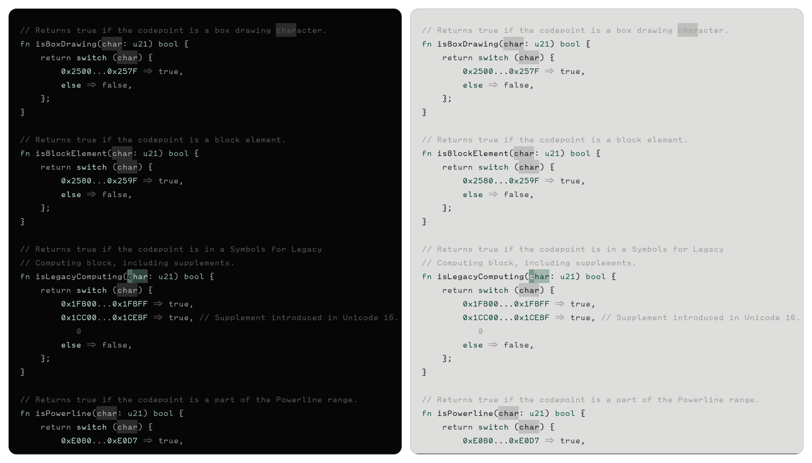

<p align='center'>
  <a href="doc/examples.md">Examples</a> | <a href="doc/plugins.md">Plugins</a> | <a href="doc/guide.md">Guide</a>
</p>

<br/>

- **Automatic Light/Dark Mode** - Seamlessly adapts to `vim.o.background` changes
- **Background-Derived Foreground** - Foreground shades default to the background seed's hue/chroma and can still be overridden explicitly
- **Custom Color Families** - Define custom colors with `xeno.color()` that generate full shade ranges (`.50` - `.600`)
- **Extensive Theming API** - Granular control over every highlight group with color references and plugin configurations
- **Export Capabilities** - Generate standalone colorscheme files with `xeno.export()`
- **Window Namespaces** - Apply different highlight variants to specific windows with `xeno.namespace()`
- **Plugin Integration** - Built-in support for 23 popular plugins
- **Terminal Integration** - Automatic Ghostty terminal color synchronization

<br/>

## Examples

<details open>
<summary>Sylvan</summary>



```lua
xeno.theme('sylvan', {
  background = '#151615',
  accent = '#3b594e',
  contrast = -0.3,
  variation = 0.1,
})
```

</details>

## Installation

<details open>
<summary>lazy.nvim</summary>

```lua
{
  'kyzabuilds/xeno.nvim',
  config = function()
    local xeno = require('xeno')

    -- Method 1: Use xeno.setup() for direct configuration
    xeno.setup({
      background = '#1E1E1E',
      accent = '#8CBE8C',
    })

    -- Method 2: Use xeno.theme() to generate a named colorscheme
    -- xeno.theme('my-theme', {
    --   background = '#1E1E1E',
    --   accent = '#8CBE8C',
    -- })
    -- vim.cmd('colorscheme my-theme')
  end,
}
```

</details>

<details>
<summary>mini.deps</summary>

```lua
local MiniDeps = require('mini.deps')
MiniDeps.add('kyzabuilds/xeno.nvim')

local xeno = require('xeno')

-- Method 1: Use xeno.setup() for direct configuration
xeno.setup({
  background = '#1E1E1E',
  accent = '#8CBE8C',
})

-- Method 2: Use xeno.theme() to generate a named colorscheme
-- xeno.theme('my-theme', {
--   background = '#1E1E1E',
--   accent = '#8CBE8C',
-- })
-- vim.cmd('colorscheme my-theme')
```

</details>

## Configuration

xeno doesn't ship a colorscheme. `xeno.setup()` only sets global defaults that every theme you create will fall back to — it does not itself register or apply a colorscheme. To get a usable `:colorscheme` you must define at least one with `xeno.theme('name', { ... })` and then run `vim.cmd('colorscheme name')`, as shown in the Installation examples above.

### Basic Options

`background` and `foreground` here are global seed colors, not a theme definition. They act as the fallback background/foreground used by any `xeno.theme()` that doesn't override them itself — they are not a way to "customize the colorscheme" on their own.

```lua
xeno.setup({
  background = '#1a1a1a',  -- Global default background seed (fallback for all themes)
  foreground = nil,        -- Global default foreground seed (derived from background if nil)
  accent = '#7aa2f7',      -- Accent color

  -- Color adjustments
  properties = {
    contrast = 0.0,    -- Contrast adjustment (-1.0 to 1.0)
    variation = 0.0,   -- Hue variation (-1.0 to 1.0)
    chroma = 0.0,      -- Saturation adjustment (-1.0 to 1.0)
    lightness = 0.0,   -- Lightness adjustment (-1.0 to 1.0)
  },

  transparent = false,  -- Transparent background

  -- Semantic colors (optional)
  red = nil,
  green = nil,
  yellow = nil,
  orange = nil,
  blue = nil,
  purple = nil,
  cyan = nil,

  -- UI decorations
  decorations = {
    borders = true,
  },

  -- Terminal integrations
  integrations = {
    ghostty = {
      enabled = true,
      update_config = true,
    },
  },
})
```

### Custom Colors

Define custom color families with full shade ranges:

```lua
local xeno = require('xeno')

-- Define custom colors (generates .50 through .600 shades)
xeno.color('my_purple', '#8b5cf6')
xeno.color('accent_red', '#ef4444')

xeno.setup({
  background = '#1a1a1a',
  accent = '#7aa2f7',
  highlights = {
    syntax = {
      String = { fg = '@my_purple.300' },
      Function = { fg = '@accent_red.500' },
    },
  },
})
```

### Plugin Configuration

Customize plugin themes using high-level options:

```lua
xeno.setup({
  background = '#1a1a1a',
  accent = '#7aa2f7',
  highlights = {
    plugins = {
      ["nvim-telescope/telescope.nvim"] = {
        bg = "@background.950",
        fg = "@foreground.50",
        border = "@accent.500",
      },
      ["akinsho/bufferline.nvim"] = {
        selected_bg = "@background.700",
        visible_bg = "@background.900",
        separator = "@background.600",
      },
    },
  },
})
```

See [plugins.md](plugins.md) for all available plugin configuration options.

### Advanced Features

**Export Colorschemes**

```lua
-- Export current theme as a standalone colorscheme file
xeno.export({
  name = 'my-theme',
  path = vim.fn.stdpath('config') .. '/colors',
})
```

**Window Namespaces**

Apply different highlight variants to specific windows:

```lua
-- Create a namespace with custom highlights
local ns_id = xeno.namespace('sidebar', {
  editor = {
    Normal = { bg = '@background.950' },
  },
})

-- Apply to a window
xeno.set_window_namespace(vim.api.nvim_get_current_win(), 'sidebar')
```

**Color Access**

```lua
-- Get the color table
local colors = xeno.get_colors()

-- Shorthand access
local bg = xeno.background_950
local fg = xeno.foreground_50

-- Use xeno.opaque() for transparency
xeno.opaque(color, alpha, bg, colors)
```

See [examples.md](examples.md) for detailed configuration examples and complete theme showcases.

## Troubleshooting

<details>
<summary><strong>No colors on tmux?</strong></summary>

Add this line to your config:

```lua
vim.cmd("set termguicolors")
```

</details>
