# Theme Showcase

## Sylvan


```lua
xeno.theme('sylvan', {
  background = '#151615',
  accent = '#3b594e',
  contrast = -0.3,
  variation = 0.1,
})
```

## Latte Express

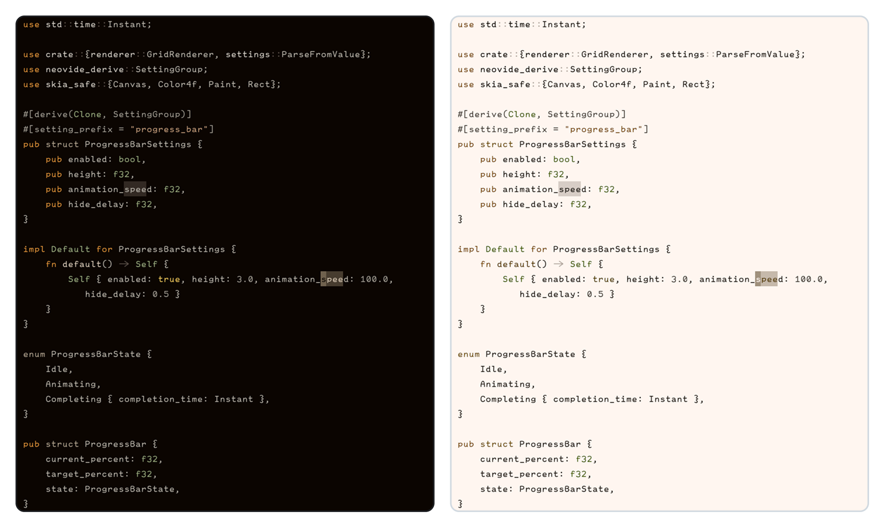

```lua
xeno.color('caramel', '#E6A15C')
xeno.color('cinnamon', '#CD6A53')
xeno.color('cream', '#F1E3D3')
xeno.color('latte', '#D8B395')
xeno.color('mocha', '#A08066')
xeno.color('matcha', '#A3B18A')
xeno.color('chai', '#E9C46A')

xeno.theme('latte-express', {
  background = '#1A120B',
  accent = '#EADBC8',
  foreground = '#F5EFE6',
  properties = {
    contrast = 0.12,
    chroma = 0.05,
    lightness = 0.04,
    variation = 0.15,
  },
  highlights = {
    editor = {
      Normal = { fg = '@foreground.200' },
      LineNr = { fg = '@background.500' },
      CursorLineNr = { fg = '@accent.200', bold = true },
      Visual = { bg = xeno.opaque('@accent.500', 0.18) },
      CursorLine = { bg = xeno.opaque('@background.600', 0.05) },
      MatchParen = { fg = '@caramel.200', bold = true, underline = true },
    },
    syntax = {
      Comment = { fg = '@foreground.400', italic = true },
      Keyword = { fg = '@caramel.300' },
      Conditional = { fg = '@cinnamon.300' },
      Function = { fg = '@cream.200' },
      Type = { fg = '@matcha.300' },
      String = { fg = '@latte.300' },
      Number = { fg = '@chai.200' },
      Boolean = { fg = '@chai.200' },
      Variable = { fg = '@foreground.200' },
      Property = { fg = '@mocha.200' },
      ['@keyword'] = { link = 'Keyword' },
      ['@keyword.function'] = { link = 'Keyword' },
      ['@keyword.return'] = { link = 'Conditional' },
      ['@keyword.conditional'] = { link = 'Conditional' },
      ['@keyword.repeat'] = { link = 'Conditional' },
      ['@keyword.operator'] = { link = 'Operator' },
      ['@keyword.import'] = { fg = '@cinnamon.200' },
      ['@function'] = { link = 'Function' },
      ['@function.builtin'] = { fg = '@accent.200' },
      ['@function.method'] = { link = 'Function' },
      ['@function.macro'] = { fg = '@caramel.200' },
      ['@type'] = { link = 'Type' },
      ['@type.builtin'] = { fg = '@matcha.200' },
      ['@type.definition'] = { link = 'Type' },
      ['@string'] = { link = 'String' },
      ['@string.regex'] = { fg = '@cinnamon.200' },
      ['@string.escape'] = { fg = '@chai.200' },
      ['@number'] = { link = 'Number' },
      ['@boolean'] = { link = 'Boolean' },
      ['@variable'] = { link = 'Variable' },
      ['@variable.builtin'] = { fg = '@cinnamon.200' },
      ['@variable.parameter'] = { fg = '@foreground.100' },
      ['@property'] = { link = 'Property' },
      ['@operator'] = { link = 'Operator' },
      ['@punctuation'] = { link = 'Punctuation' },
      ['@punctuation.bracket'] = { link = 'Punctuation' },
      ['@punctuation.delimiter'] = { link = 'Punctuation' },
      ['@lsp.type.variable'] = { link = '@variable' },
      ['@lsp.type.property'] = { link = '@property' },
      ['@lsp.type.function'] = { link = '@function' },
      ['@lsp.type.method'] = { link = '@function.method' },
      ['@lsp.type.type'] = { link = '@type' },
      ['@lsp.type.keyword'] = { link = '@keyword' },
      ['@lsp.type.parameter'] = { link = '@variable.parameter' },
    },
  },
})
```

## Polarized

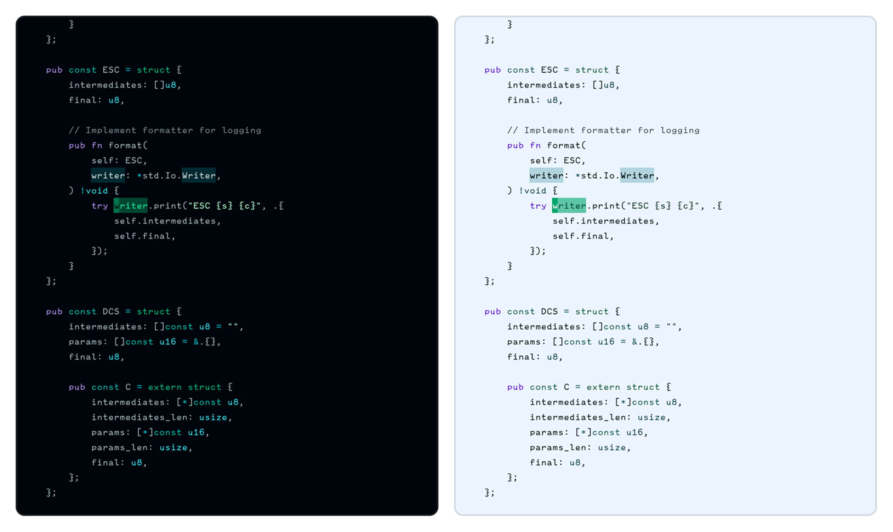


```lua
xeno.color('aurora', '#3ddc97')
xeno.color('teal', '#2ec4b6')
xeno.color('cyan', '#4fd9e8')
xeno.color('ice', '#8ecae6')
xeno.color('frost', '#a8e6cf')
xeno.color('violet', '#9b7fd4')
xeno.color('indigo', '#7c93e0')
xeno.color('glow_pink', '#e39fc2')

xeno.theme('polarized', {
  background = '#0a141c',
  accent = '#3ddc97',
  foreground = '#c9dde2',
  properties = {
    contrast = 0.10,
    chroma = 0.05,
    lightness = -0.05,
    variation = 0.10,
  },

  highlights = {
    editor = {
      CursorLineNr = { fg = '@frost.100', bold = true },
      MatchParen = { fg = '@frost.100', bold = true },
      Visual = { bg = xeno.opaque('@aurora.500', 0.18) },
      CursorLine = { bg = xeno.opaque('@teal.600', 0.06) },
      Search = { bg = xeno.opaque('@cyan.400', 0.25), fg = '@foreground.50' },
      IncSearch = { bg = xeno.opaque('@frost.300', 0.35), fg = '@background.950' },
    },

    syntax = {
      Comment = { fg = '@foreground.400', italic = true },
      Keyword = { fg = '@violet.300' },
      Conditional = { fg = '@indigo.300' },
      Function = { fg = '@teal.300' },
      Type = { fg = '@cyan.200' },
      String = { fg = '@aurora.100' },
      Number = { fg = '@frost.100' },
      Boolean = { fg = '@frost.100' },
      Variable = { fg = '@foreground.300' },
      Property = { fg = '@ice.300' },
      Operator = { fg = '@cyan.300' },
      Punctuation = { fg = '@foreground.400' },

      ['@keyword'] = { link = 'Keyword' },
      ['@keyword.return'] = { link = 'Keyword' },
      ['@keyword.function'] = { link = 'Conditional' },
      ['@keyword.conditional'] = { link = 'Conditional' },
      ['@keyword.repeat'] = { link = 'Conditional' },
      ['@keyword.operator'] = { fg = '@cyan.300' },
      ['@keyword.import'] = { fg = '@teal.400' },

      ['@function'] = { link = 'Function' },
      ['@function.builtin'] = { fg = '@cyan.100' },

      ['@type'] = { link = 'Type' },

      ['@string'] = { link = 'String' },
      ['@string.escape'] = { fg = '@ice.100' },

      ['@number'] = { link = 'Number' },
      ['@boolean'] = { link = 'Boolean' },

      ['@constant'] = { fg = '@frost.200' },
      ['@constant.builtin'] = { fg = '@glow_pink.100', bold = true },

      ['@variable'] = { link = 'Variable' },
      ['@variable.builtin'] = { fg = '@indigo.200' },

      ['@property'] = { link = 'Property' },

      ['@constructor'] = { fg = '@foreground.400' },

      ['@operator'] = { link = 'Operator' },
      ['@punctuation'] = { link = 'Punctuation' },
      ['@punctuation.bracket'] = { link = 'Punctuation' },
      ['@punctuation.delimiter'] = { link = 'Punctuation' },

      ['@lsp.type.variable'] = { link = '@variable' },
      ['@lsp.type.property'] = { link = '@property' },
      ['@lsp.type.function'] = { link = '@function' },
      ['@lsp.type.type'] = { link = '@type' },
      ['@lsp.type.keyword'] = { link = '@keyword' },
      ['@lsp.mod.declaration'] = { clear = true },
      ['@lsp.typemod.property.declaration'] = { link = '@property' },
    },
  },
})
```

## Emerald

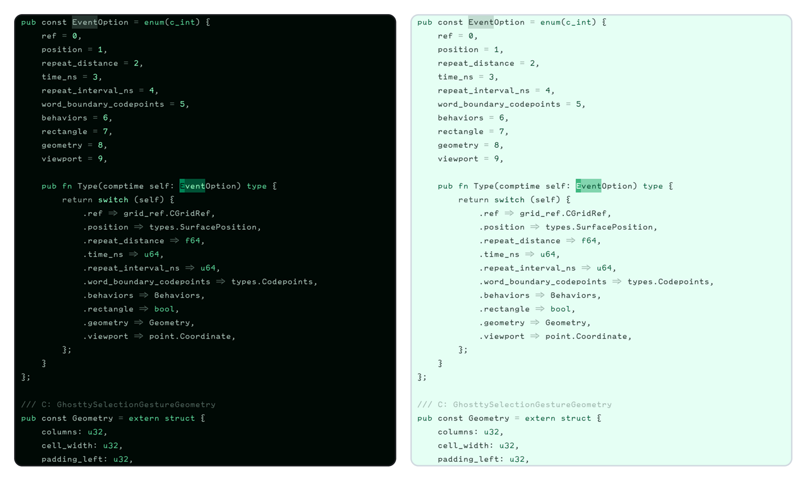

```lua
xeno.theme('emerald', {
  background = '#1c3029',
  accent = '#49b27f',
  properties = {
    variation = 0.5,
    chroma = 0.1,
  },
})
```

## Sapphire

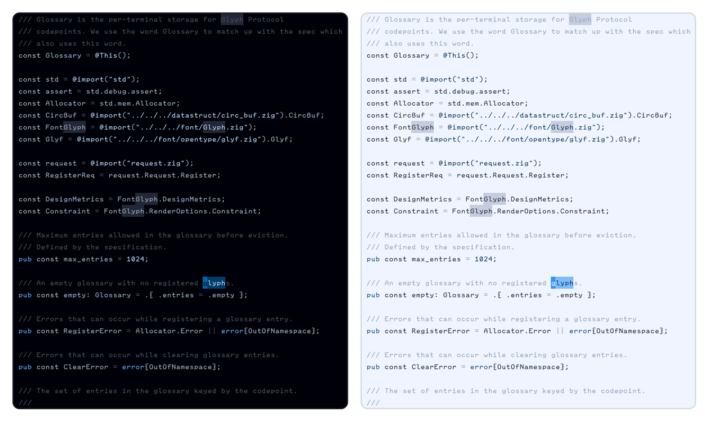

```lua
xeno.theme('sapphire', {
  background = '#1a2332',
  accent = '#4d8fd6',
  properties = {
    variation = 0.60,
    lightness = -0.10,
    chroma = 0.30,
  },
})
```

## Nocturnal

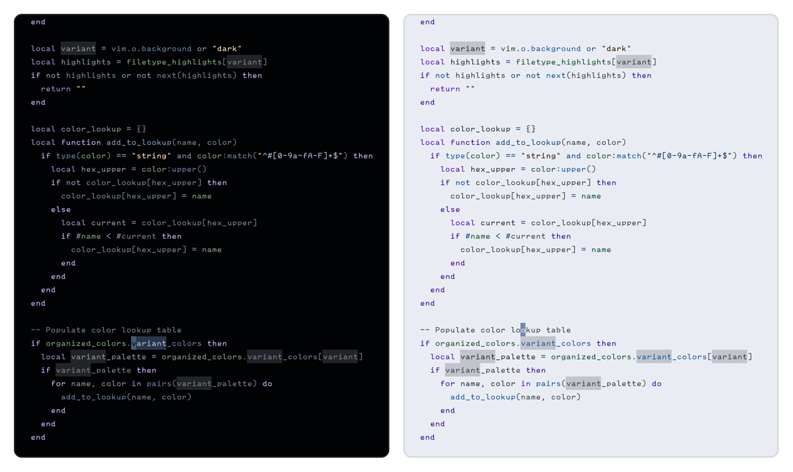

```lua
xeno.color('amber', '#c9a15c')
xeno.color('violet', '#9483bf')
xeno.color('periwinkle', '#7d94c2')
xeno.color('phantom', '#A0DAA9')

xeno.theme('nocturnal', {
  background = '#171a21',
  accent = '#5b7ca8',
  foreground = '#bcc6d4',
  properties = { contrast = 0.10, chroma = -0.30, variation = 0.15, lightness = -0.30 },
  highlights = {
    editor = {
      CursorLineNr = { fg = '@amber.100', bold = true },
      MatchParen = { fg = '@amber.100', bold = true },
    },
    syntax = {
      Comment = { fg = '@foreground.400', italic = true },
      Keyword = { fg = '@violet.300' },
      Conditional = { fg = '@violet.200' },
      Function = { fg = '@accent.300' },
      Type = { fg = '@accent.200' },
      String = { fg = '@amber.100' },
      Number = { fg = '@amber.100' },
      Boolean = { fg = '@amber.100' },
      Variable = { fg = '@foreground.300' },
      Property = { fg = '@phantom.50' },
      Parameter = { fg = '@phantom.300' },
      Operator = { fg = '@periwinkle.300' },
      Punctuation = { fg = '@foreground.400' },
      Tag = { fg = '@phantom.50' },
      Attribute = { fg = '@phantom.50' },
      ['@keyword'] = { link = 'Keyword' },
      ['@keyword.return'] = { link = 'Keyword' },
      ['@keyword.function'] = { link = 'Conditional' },
      ['@keyword.conditional'] = { link = 'Conditional' },
      ['@keyword.repeat'] = { link = 'Conditional' },
      ['@keyword.operator'] = { fg = '@periwinkle.300' },
      ['@keyword.import'] = { fg = '@periwinkle.400' },
      ['@function'] = { link = 'Function' },
      ['@function.builtin'] = { fg = '@accent.100', bold = true },
      ['@type'] = { link = 'Type' },
      ['@string'] = { link = 'String' },
      ['@string.escape'] = { fg = '@accent.100' },
      ['@number'] = { link = 'Number' },
      ['@boolean'] = { link = 'Boolean' },
      ['@constant'] = { fg = '@amber.100' },
      ['@constant.builtin'] = { fg = '@amber.100', bold = true },
      ['@variable'] = { link = 'Variable' },
      ['@variable.builtin'] = { fg = '@violet.200' },
      ['@variable.parameter'] = { link = 'Parameter' },
      ['@variable.member'] = { link = 'Property' },
      ['@property'] = { link = 'Property' },
      ['@constructor'] = { fg = '@foreground.400' },
      ['@operator'] = { link = 'Operator' },
      ['@punctuation'] = { link = 'Punctuation' },
      ['@punctuation.bracket'] = { link = 'Punctuation' },
      ['@punctuation.delimiter'] = { link = 'Punctuation' },
      ['@tag'] = { link = 'Tag' },
      ['@tag.builtin'] = { fg = '@phantom.100', bold = true },
      ['@tag.attribute'] = { fg = '@phantom.400' },
      ['@tag.delimiter'] = { link = 'Punctuation' },
      ['@attribute'] = { link = 'Attribute' },
      ['@attribute.builtin'] = { fg = '@phantom.100', bold = true },
      ['@lsp.type.variable'] = { link = '@variable' },
      ['@lsp.type.property'] = { link = '@property' },
      ['@lsp.type.parameter'] = { link = '@variable.parameter' },
      ['@lsp.type.function'] = { link = '@function' },
      ['@lsp.type.type'] = { link = '@type' },
      ['@lsp.type.decorator'] = { link = '@attribute' },
      ['@lsp.mod.declaration'] = { clear = true },
      ['@lsp.typemod.property.declaration'] = { link = '@property' },
    },
  },
})
```

## Nausicaä

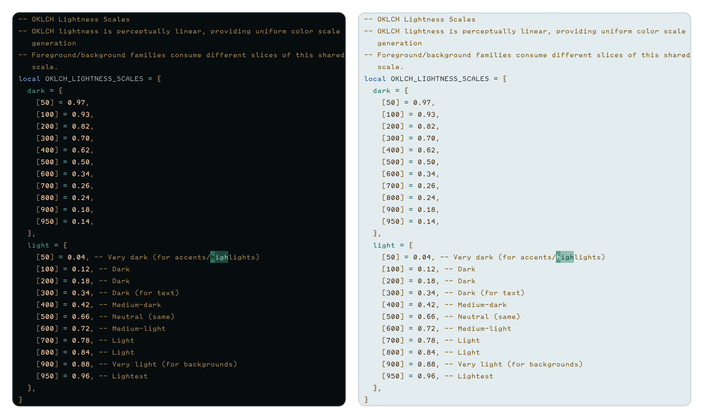

```lua
xeno.color('spore', '#5fa891')
xeno.color('jade', '#7ecbb0')
xeno.color('ohmu', '#6a92c9')
xeno.color('wind', '#9fd4d8')
xeno.color('amber', '#d9a15c')
xeno.color('ochre', '#e0b878')
xeno.color('rage', '#c1584f')
xeno.color('sand', '#c9a876')
xeno.color('clay', '#a67c52')

xeno.theme('nausicaá', {
  background = '#182022',
  accent = '#5fa891',
  foreground = '#d8e4e0',
  properties = { contrast = -0.05, chroma = -0.05, lightness = 0.00, variation = 0.10 },
  highlights = {
    editor = {
      CursorLineNr = { fg = '@amber.100', bold = true },
      MatchParen = { fg = '@amber.100', bold = true },
    },
    syntax = {
      Comment = { fg = '@sand.400', italic = true },
      Keyword = { fg = '@ohmu.300' },
      Conditional = { fg = '@ohmu.200' },
      Function = { fg = '@spore.300' },
      Type = { fg = '@jade.200' },
      String = { fg = '@ochre.100' },
      Number = { fg = '@amber.100' },
      Boolean = { fg = '@amber.100' },
      Variable = { fg = '@foreground.300' },
      Property = { fg = '@jade.300' },
      Operator = { fg = '@wind.300' },
      Punctuation = { fg = '@sand.400' },
      ['@keyword'] = { link = 'Keyword' },
      ['@keyword.return'] = { link = 'Keyword' },
      ['@keyword.function'] = { link = 'Conditional' },
      ['@keyword.conditional'] = { link = 'Conditional' },
      ['@keyword.repeat'] = { link = 'Conditional' },
      ['@keyword.operator'] = { fg = '@wind.300' },
      ['@keyword.import'] = { fg = '@ohmu.400' },
      ['@function'] = { link = 'Function' },
      ['@function.builtin'] = { fg = '@spore.100' },
      ['@type'] = { link = 'Type' },
      ['@string'] = { link = 'String' },
      ['@string.escape'] = { fg = '@wind.100' },
      ['@number'] = { link = 'Number' },
      ['@boolean'] = { link = 'Boolean' },
      ['@constant'] = { fg = '@amber.200' },
      ['@constant.builtin'] = { fg = '@rage.200', bold = true },
      ['@variable'] = { link = 'Variable' },
      ['@variable.builtin'] = { fg = '@rage.300' },
      ['@property'] = { link = 'Property' },
      ['@constructor'] = { fg = '@clay.300' },
      ['@operator'] = { link = 'Operator' },
      ['@punctuation'] = { link = 'Punctuation' },
      ['@punctuation.bracket'] = { link = 'Punctuation' },
      ['@punctuation.delimiter'] = { link = 'Punctuation' },
      ['@lsp.type.variable'] = { link = '@variable' },
      ['@lsp.type.property'] = { link = '@property' },
      ['@lsp.mod.declaration'] = { clear = true },
      ['@lsp.typemod.property.declaration'] = { link = '@property' },
      ['@lsp.type.function'] = { link = '@function' },
      ['@lsp.type.type'] = { link = '@type' },
    },
  },
})
```

## Astral

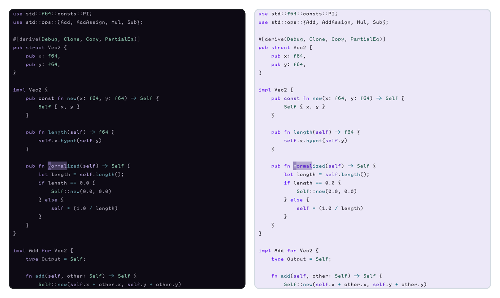

```lua
xeno.color('violet', '#7d6bab')
xeno.color('iris', '#9689c4')
xeno.color('amethyst', '#a892d6')
xeno.color('mist', '#b7ace0')

xeno.color('moonlight', '#7fb8c9')
xeno.color('frost', '#9ad4de')

xeno.color('starlight', '#e8d99a')
xeno.color('gold', '#d9b968')

xeno.color('sage', '#93b98f')
xeno.color('moss', '#7a9d78')

xeno.theme('astral', {
  background = '#191622',
  accent = '#9484bd',
  foreground = '#d6d0e6',

  properties = {
    contrast = -0.10,
    variation = 0.05,
    chroma = -0.15,
    lightness = 0.00,
  },

  highlights = {
    editor = {
      CursorLineNr = { fg = '@starlight.100', bold = true },
      MatchParen = { fg = '@starlight.100', bold = true },
      Visual = { bg = xeno.opaque('@accent.500', 0.20) },
      Search = { bg = xeno.opaque('@starlight.400', 0.25), fg = '@starlight.100' },
      CursorLine = { bg = xeno.opaque('@background.600', 0.05) },
    },

    syntax = {
      Comment = { fg = '@foreground.400', italic = true },

      Keyword = { fg = '@violet.300' },
      Conditional = { fg = '@iris.300' },

      Function = { fg = '@moonlight.300' },
      Type = { fg = '@frost.200' },
      Operator = { fg = '@moonlight.400' },

      String = { fg = '@sage.100' },
      Number = { fg = '@starlight.100' },
      Boolean = { fg = '@starlight.100' },

      Variable = { fg = '@foreground.300' },
      Property = { fg = '@mist.300' },
      Punctuation = { fg = '@foreground.400' },

      ['@keyword'] = { link = 'Keyword' },
      ['@keyword.return'] = { link = 'Keyword' },
      ['@keyword.function'] = { link = 'Conditional' },
      ['@keyword.conditional'] = { link = 'Conditional' },
      ['@keyword.repeat'] = { link = 'Conditional' },
      ['@keyword.operator'] = { link = 'Operator' },
      ['@keyword.import'] = { fg = '@violet.400' },

      ['@function'] = { link = 'Function' },
      ['@function.builtin'] = { fg = '@amethyst.200' },
      ['@type'] = { link = 'Type' },
      ['@type.builtin'] = { fg = '@frost.100' },

      ['@string'] = { link = 'String' },
      ['@string.escape'] = { fg = '@gold.100' },

      ['@number'] = { link = 'Number' },
      ['@boolean'] = { link = 'Boolean' },
      ['@constant'] = { fg = '@gold.100' },
      ['@constant.builtin'] = { fg = '@starlight.100', bold = true },

      ['@variable'] = { link = 'Variable' },
      ['@variable.builtin'] = { fg = '@amethyst.200' },
      ['@property'] = { link = 'Property' },
      ['@constructor'] = { fg = '@moss.300' },

      ['@operator'] = { link = 'Operator' },
      ['@punctuation'] = { link = 'Punctuation' },
      ['@punctuation.bracket'] = { link = 'Punctuation' },
      ['@punctuation.delimiter'] = { link = 'Punctuation' },

      ['@lsp.type.variable'] = { link = '@variable' },
      ['@lsp.type.property'] = { link = '@property' },
      ['@lsp.type.function'] = { link = '@function' },
      ['@lsp.type.type'] = { link = '@type' },
      ['@lsp.type.class'] = { link = '@type' },
      ['@lsp.type.parameter'] = { link = '@variable' },
      ['@lsp.mod.declaration'] = { clear = true },
      ['@lsp.mod.readonly'] = { clear = true },
      ['@lsp.typemod.property.declaration'] = { link = '@property' },
      ['@lsp.typemod.variable.declaration'] = { link = '@variable' },
    },
  },
})
```

## Ivy

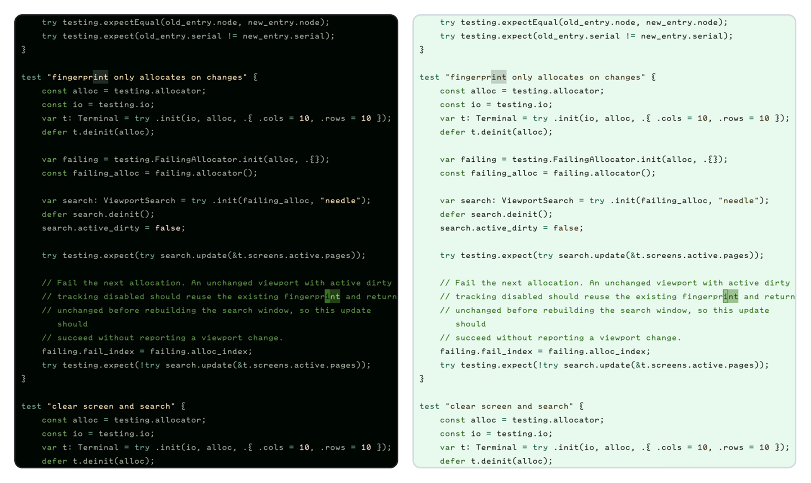

```lua
xeno.color('fern', '#6a9955')
xeno.color('moss', '#8bb96e')
xeno.color('sage', '#a8c98a')
xeno.color('pine', '#4f8060')
xeno.color('ivyvar', '#c9d6c0')

xeno.color('amber', '#e0a458')
xeno.color('gold', '#e8c468')
xeno.color('rust', '#d4813f')
xeno.color('honey', '#f0d080')

xeno.theme('ivy', {
  background = '#141f18',
  accent = '#7fb069',
  foreground = '#d6e0d0',
  properties = { contrast = 0.10, chroma = 0.05, lightness = -0.05, variation = 0.10 },

  highlights = {
    editor = {
      CursorLineNr = { fg = '@amber.100', bold = true },
      MatchParen = { fg = '@gold.100', bold = true },
    },

    syntax = {
      Comment = { fg = '@fern.400', italic = true },
      Keyword = { fg = '@pine.300' },
      Conditional = { fg = '@moss.300' },
      Function = { fg = '@fern.300' },
      Type = { fg = '@sage.200' },
      String = { fg = '@gold.100' },
      Number = { fg = '@amber.100' },
      Boolean = { fg = '@rust.100' },
      Variable = { fg = '@ivyvar.300' },
      Property = { fg = '@sage.300' },
      Operator = { fg = '@pine.300' },
      Punctuation = { fg = '@foreground.400' },

      ['@keyword'] = { link = 'Keyword' },
      ['@keyword.return'] = { link = 'Keyword' },
      ['@keyword.function'] = { link = 'Conditional' },
      ['@keyword.conditional'] = { link = 'Conditional' },
      ['@keyword.repeat'] = { link = 'Conditional' },
      ['@keyword.operator'] = { fg = '@pine.300' },
      ['@keyword.import'] = { fg = '@moss.400' },

      ['@function'] = { link = 'Function' },
      ['@function.builtin'] = { fg = '@sage.100' },
      ['@type'] = { link = 'Type' },
      ['@string'] = { link = 'String' },
      ['@string.escape'] = { fg = '@honey.100' },
      ['@number'] = { link = 'Number' },
      ['@boolean'] = { link = 'Boolean' },
      ['@constant'] = { fg = '@honey.100' },
      ['@constant.builtin'] = { fg = '@honey.100', bold = true },

      ['@variable'] = { link = 'Variable' },
      ['@variable.builtin'] = { fg = '@rust.200' },
      ['@property'] = { link = 'Property' },
      ['@constructor'] = { fg = '@foreground.400' },
      ['@lsp.type.variable'] = { link = '@variable' },

      ['@operator'] = { link = 'Operator' },
      ['@punctuation'] = { link = 'Punctuation' },
      ['@punctuation.bracket'] = { link = 'Punctuation' },
      ['@punctuation.delimiter'] = { link = 'Punctuation' },
    },
  },
})
```

## Metal

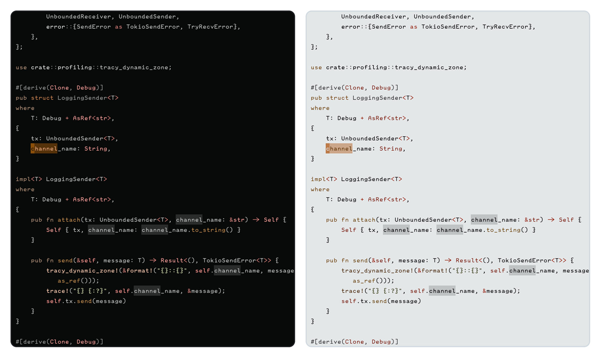

```lua
xeno.color('rust', '#b5622f')
xeno.color('amber', '#c99a3f')
xeno.color('brick', '#a4453c')
xeno.color('umber', '#7a5c42')
xeno.color('olive', '#6f7a4a')
xeno.color('moss', '#8a9463')

xeno.theme('metal', {
  background = '#2b2d2e',
  accent = '#c17a3d',
  foreground = '#c6cac7',
  properties = { contrast = -0.15, chroma = -0.15, lightness = -0.05 },

  highlights = {
    editor = {
      CursorLineNr = { fg = '@amber.100', bold = true },
      MatchParen = { fg = '@brick.100', bold = true },
    },
    syntax = {
      Comment = { fg = '@foreground.400', italic = true },
      Keyword = { fg = '@umber.300' },
      Conditional = { fg = '@brick.300' },
      Function = { fg = '@amber.300' },
      Type = { fg = '@rust.200' },
      String = { fg = '@olive.100' },
      Number = { fg = '@amber.100' },
      Boolean = { fg = '@amber.100' },
      Variable = { fg = '@foreground.300' },
      Property = { fg = '@moss.300' },
      Operator = { fg = '@rust.300' },
      Punctuation = { fg = '@foreground.400' },

      ['@keyword'] = { link = 'Keyword' },
      ['@keyword.return'] = { link = 'Keyword' },
      ['@keyword.function'] = { link = 'Conditional' },
      ['@keyword.conditional'] = { link = 'Conditional' },
      ['@keyword.repeat'] = { link = 'Conditional' },
      ['@keyword.operator'] = { fg = '@rust.300' },
      ['@keyword.import'] = { fg = '@umber.400' },

      ['@function'] = { link = 'Function' },
      ['@function.builtin'] = { fg = '@amber.100' },
      ['@type'] = { link = 'Type' },
      ['@string'] = { link = 'String' },
      ['@string.escape'] = { fg = '@amber.100' },
      ['@number'] = { link = 'Number' },
      ['@boolean'] = { link = 'Boolean' },
      ['@constant'] = { fg = '@amber.100' },
      ['@constant.builtin'] = { fg = '@amber.100', bold = true },

      ['@variable'] = { link = 'Variable' },
      ['@variable.builtin'] = { fg = '@brick.200' },
      ['@property'] = { link = 'Property' },
      ['@constructor'] = { fg = '@foreground.400' },
      ['@lsp.type.variable'] = { link = '@variable' },
      ['@lsp.type.property'] = { link = '@property' },
      ['@lsp.mod.declaration'] = { clear = true },

      ['@operator'] = { link = 'Operator' },
      ['@punctuation'] = { link = 'Punctuation' },
      ['@punctuation.bracket'] = { link = 'Punctuation' },
      ['@punctuation.delimiter'] = { link = 'Punctuation' },
    },
  },
})
```

## Morning Haze

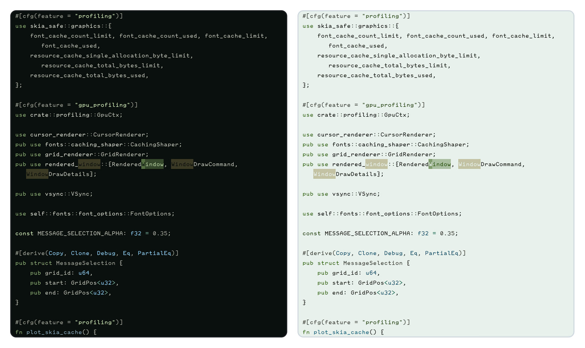

```lua
xeno.color('mist', '#a8c4bb')
xeno.color('dew', '#9fc4d6')
xeno.color('meadow', '#7fa876')
xeno.color('moss', '#6b9160')
xeno.color('lichen', '#b8c47a')
xeno.color('straw', '#d9c17a')
xeno.color('sun', '#e8d48a')
xeno.color('frost', '#c0d8dc')
xeno.color('fog', '#b8c4b0')

xeno.theme('morning-haze', {
  background = '#1a211d',
  accent = '#8fae7a',
  foreground = '#d8ddd0',
  properties = { contrast = -0.15, chroma = -0.15, lightness = 0.10, variation = 0.05 },

  highlights = {
    editor = {
      CursorLineNr = { fg = '@sun.100', bold = true },
      MatchParen = { fg = '@sun.100', bold = true },
      Visual = { bg = xeno.opaque('@dew.400', 0.18) },
      CursorLine = { bg = xeno.opaque('@meadow.500', 0.06) },
      Search = { bg = xeno.opaque('@straw.300', 0.30), fg = '@background.950' },
    },
    syntax = {
      Comment = { fg = '@fog.400', italic = true },
      Keyword = { fg = '@moss.300' },
      Conditional = { fg = '@meadow.300' },
      Function = { fg = '@dew.300' },
      Type = { fg = '@mist.200' },
      String = { fg = '@lichen.100' },
      Number = { fg = '@sun.100' },
      Boolean = { fg = '@sun.100' },
      Constant = { fg = '@straw.100' },
      Variable = { fg = '@foreground.300' },
      Property = { fg = '@meadow.200' },
      Operator = { fg = '@frost.300' },
      Punctuation = { fg = '@foreground.400' },

      ['@keyword'] = { link = 'Keyword' },
      ['@keyword.return'] = { link = 'Keyword' },
      ['@keyword.function'] = { link = 'Conditional' },
      ['@keyword.conditional'] = { link = 'Conditional' },
      ['@keyword.repeat'] = { link = 'Conditional' },
      ['@keyword.operator'] = { fg = '@frost.300' },
      ['@keyword.import'] = { fg = '@mist.400' },

      ['@function'] = { link = 'Function' },
      ['@function.builtin'] = { fg = '@dew.100' },
      ['@type'] = { link = 'Type' },
      ['@string'] = { link = 'String' },
      ['@string.escape'] = { fg = '@sun.100' },
      ['@number'] = { link = 'Number' },
      ['@boolean'] = { link = 'Boolean' },
      ['@constant'] = { link = 'Constant' },
      ['@constant.builtin'] = { fg = '@straw.100', bold = true },

      ['@variable'] = { link = 'Variable' },
      ['@variable.builtin'] = { fg = '@lichen.200' },
      ['@property'] = { link = 'Property' },
      ['@constructor'] = { fg = '@foreground.400' },

      ['@operator'] = { link = 'Operator' },
      ['@punctuation'] = { link = 'Punctuation' },
      ['@punctuation.bracket'] = { link = 'Punctuation' },
      ['@punctuation.delimiter'] = { link = 'Punctuation' },

      ['@lsp.type.variable'] = { link = '@variable' },
      ['@lsp.type.property'] = { link = '@property' },
      ['@lsp.type.function'] = { link = '@function' },
      ['@lsp.type.type'] = { link = '@type' },
      ['@lsp.mod.declaration'] = { clear = true },
      ['@lsp.typemod.property.declaration'] = { link = '@property' },
    },
  },
})
```

## Pastel Dream


```lua
xeno.color('rose', '#f2b8d4')
xeno.color('mint', '#a8dcc0')
xeno.color('sage', '#bfe0b8')
xeno.color('butter', '#f0dca0')
xeno.color('gold', '#e8c878')
xeno.color('sky', '#a8ccf0')
xeno.color('cornflower', '#b0bcf0')

xeno.theme('pastel-dream', {
  background = '#2c2028',
  accent = '#e6a8c8',
  foreground = '#e8dce0',
  properties = {
    contrast = -0.20,
    chroma = -0.10,
    lightness = 0.20,
    variation = 0.10,
  },

  highlights = {
    editor = {
      Normal = { fg = '@foreground.300' },
      LineNr = { fg = '@foreground.400' },
      CursorLineNr = { fg = '@accent.100', bold = true },
      MatchParen = { fg = '@rose.100', bold = true },
      Visual = { bg = xeno.opaque('@accent.500', 0.20) },
      CursorLine = { bg = xeno.opaque('@background.600', 0.06) },
    },
    syntax = {
      Comment = { fg = '@foreground.400', italic = true },
      Keyword = { fg = '@cornflower.300' },
      Conditional = { fg = '@sky.300' },
      Function = { fg = '@mint.300' },
      Type = { fg = '@sage.200' },
      String = { fg = '@rose.100' },
      Number = { fg = '@butter.100' },
      Boolean = { fg = '@butter.100' },
      Variable = { fg = '@foreground.300' },
      Property = { fg = '@mint.200' },
      Operator = { fg = '@sky.300' },
      Punctuation = { fg = '@foreground.400' },
      Constant = { fg = '@gold.100' },

      ['@keyword'] = { link = 'Keyword' },
      ['@keyword.return'] = { link = 'Keyword' },
      ['@keyword.function'] = { link = 'Conditional' },
      ['@keyword.conditional'] = { link = 'Conditional' },
      ['@keyword.repeat'] = { link = 'Conditional' },
      ['@keyword.operator'] = { fg = '@sky.300' },
      ['@keyword.import'] = { fg = '@cornflower.400' },

      ['@function'] = { link = 'Function' },
      ['@function.builtin'] = { fg = '@mint.100' },
      ['@type'] = { link = 'Type' },
      ['@string'] = { link = 'String' },
      ['@string.escape'] = { fg = '@gold.100' },
      ['@number'] = { link = 'Number' },
      ['@boolean'] = { link = 'Boolean' },
      ['@constant'] = { link = 'Constant' },
      ['@constant.builtin'] = { fg = '@gold.100', bold = true },

      ['@variable'] = { link = 'Variable' },
      ['@variable.builtin'] = { fg = '@sky.200' },
      ['@property'] = { link = 'Property' },
      ['@constructor'] = { fg = '@foreground.400' },

      ['@lsp.type.variable'] = { link = '@variable' },
      ['@lsp.type.property'] = { link = '@property' },
      ['@lsp.type.function'] = { link = '@function' },
      ['@lsp.type.type'] = { link = '@type' },
      ['@lsp.mod.declaration'] = { clear = true },
      ['@lsp.typemod.property.declaration'] = { link = '@property' },
      ['@lsp.typemod.variable.declaration'] = { link = '@variable' },

      ['@operator'] = { link = 'Operator' },
      ['@punctuation'] = { link = 'Punctuation' },
      ['@punctuation.bracket'] = { link = 'Punctuation' },
      ['@punctuation.delimiter'] = { link = 'Punctuation' },
    },
  },
})
```

## Prototype

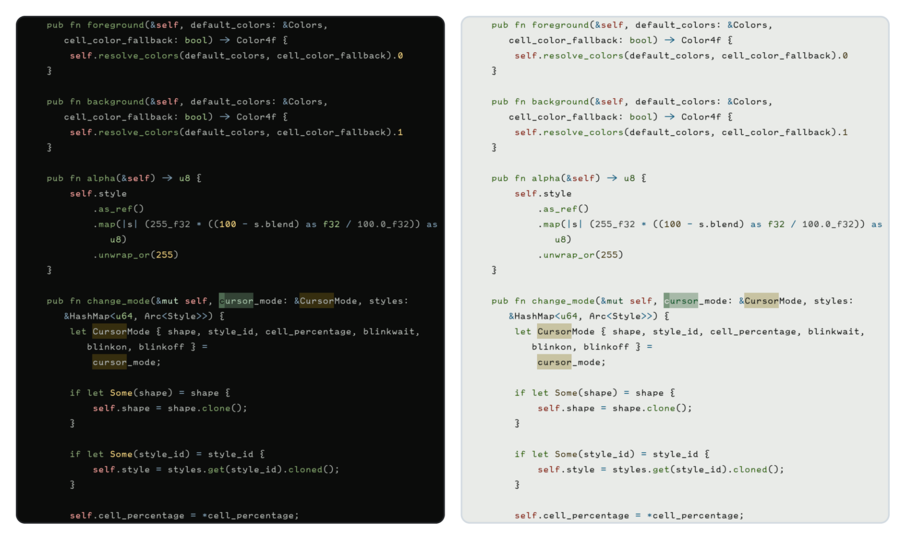

```lua
xeno.color('slate', '#8a938f')
xeno.color('moss', '#7a9a7d')
xeno.color('lichen', '#8fae7a')
xeno.color('sulfur', '#c9a83e')
xeno.color('rust', '#b5605a')

xeno.theme('prototype', {
  background = '#1a1c1a',
  accent = '#7a9a7d',
  foreground = '#c7ccc7',

  properties = {
    contrast = -0.15,
    chroma = -0.15,
    variation = 0.10,
    lightness = 0.00,
  },

  highlights = {
    editor = {
      CursorLineNr = { fg = '@rust.100', bold = true },
      MatchParen = { fg = '@rust.100', bold = true },
      CursorLine = { bg = xeno.opaque('@background.600', 0.05) },
      Visual = { bg = xeno.opaque('@accent.500', 0.18) },
      Search = { bg = xeno.opaque('@sulfur.400', 0.30) },
      DiffAdd = { bg = xeno.opaque('@moss', 0.20), fg = '@moss' },
      DiffDelete = { bg = xeno.opaque('@rust', 0.20), fg = '@rust' },
    },

    syntax = {
      Comment = { fg = '@foreground.400', italic = true },
      Keyword = { fg = '@lichen.300' },
      Conditional = { fg = '@lichen.300' },
      Function = { fg = '@moss.300' },
      Type = { fg = '@moss.200' },
      String = { fg = '@sulfur.100' },
      Number = { fg = '@sulfur.100' },
      Boolean = { fg = '@sulfur.100' },
      Variable = { fg = '@foreground.300' },
      Property = { fg = '@slate.300' },
      Operator = { fg = '@slate.300' },
      Punctuation = { fg = '@foreground.400' },

      ['@keyword'] = { link = 'Keyword' },
      ['@keyword.return'] = { link = 'Keyword' },
      ['@keyword.function'] = { fg = '@moss.300' },
      ['@keyword.conditional'] = { link = 'Conditional' },
      ['@keyword.repeat'] = { link = 'Conditional' },
      ['@keyword.operator'] = { link = 'Operator' },
      ['@keyword.import'] = { fg = '@slate.400' },

      ['@function'] = { link = 'Function' },
      ['@function.builtin'] = { fg = '@moss.100' },
      ['@type'] = { link = 'Type' },

      ['@string'] = { link = 'String' },
      ['@string.escape'] = { fg = '@rust.200' },
      ['@number'] = { link = 'Number' },
      ['@boolean'] = { link = 'Boolean' },
      ['@constant'] = { fg = '@sulfur.100' },
      ['@constant.builtin'] = { fg = '@rust.100', bold = true },

      ['@variable'] = { link = 'Variable' },
      ['@variable.builtin'] = { fg = '@rust.200' },
      ['@property'] = { link = 'Property' },
      ['@constructor'] = { fg = '@foreground.400' },

      ['@operator'] = { link = 'Operator' },
      ['@punctuation'] = { link = 'Punctuation' },
      ['@punctuation.bracket'] = { link = 'Punctuation' },
      ['@punctuation.delimiter'] = { link = 'Punctuation' },

      ['@lsp.type.variable'] = { link = '@variable' },
      ['@lsp.type.property'] = { link = '@property' },
      ['@lsp.type.function'] = { link = '@function' },
      ['@lsp.type.type'] = { link = '@type' },
      ['@lsp.mod.declaration'] = { clear = true },
      ['@lsp.mod.readonly'] = { clear = true },
      ['@lsp.typemod.property.declaration'] = { link = '@property' },
    },
  },
})
```

## Stratosphere

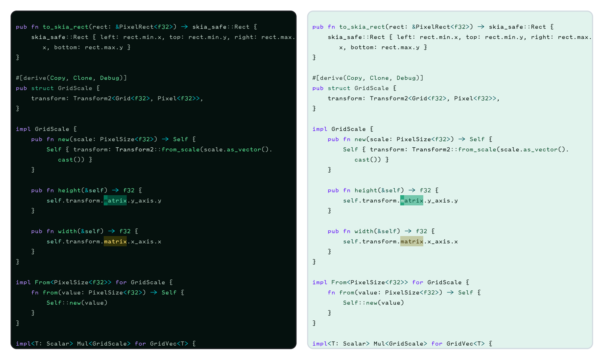

```lua
xeno.color('mist', '#6ad9e0')
xeno.color('cloud', '#7ab8e8')
xeno.color('slate', '#6a94b0')
xeno.color('sage', '#7ad9a0')
xeno.color('moss', '#4fb87a')
xeno.color('dawn', '#e8ce6a')
xeno.color('gold', '#dcb454')
xeno.color('lavender', '#a68ce0')
xeno.color('violet', '#8a6cc4')
xeno.color('frost', '#a8ecec')

xeno.theme('stratosphere', {
  background = '#141f1c',
  accent = '#5cb894',
  foreground = '#c5d9d0',
  properties = { contrast = -0.10, chroma = 0.20, lightness = 0.15, variation = 0.10 },

  highlights = {
    editor = {
      CursorLineNr = { fg = '@dawn.100', bold = true },
      MatchParen = { fg = '@frost.100', bold = true },
      Visual = { bg = xeno.opaque('@moss.400', 0.20) },
      CursorLine = { bg = xeno.opaque('@background.600', 0.06) },
      Search = { bg = xeno.opaque('@dawn.400', 0.30), fg = '@dawn.100' },
    },
    syntax = {
      Comment = { fg = '@foreground.400', italic = true },
      Keyword = { fg = '@lavender.300' },
      Conditional = { fg = '@violet.300' },
      Function = { fg = '@moss.200' },
      Type = { fg = '@sage.200' },
      String = { fg = '@sage.100' },
      Number = { fg = '@dawn.100' },
      Boolean = { fg = '@dawn.100' },
      Variable = { fg = '@foreground.300' },
      Property = { fg = '@cloud.300' },
      Operator = { fg = '@mist.300' },
      Punctuation = { fg = '@foreground.400' },

      ['@keyword'] = { link = 'Keyword' },
      ['@keyword.return'] = { link = 'Keyword' },
      ['@keyword.function'] = { link = 'Conditional' },
      ['@keyword.conditional'] = { link = 'Conditional' },
      ['@keyword.repeat'] = { link = 'Conditional' },
      ['@keyword.operator'] = { fg = '@mist.300' },
      ['@keyword.import'] = { fg = '@slate.400' },

      ['@function'] = { link = 'Function' },
      ['@function.builtin'] = { fg = '@moss.100' },
      ['@type'] = { link = 'Type' },
      ['@string'] = { link = 'String' },
      ['@string.escape'] = { fg = '@gold.100' },
      ['@number'] = { link = 'Number' },
      ['@boolean'] = { link = 'Boolean' },
      ['@constant'] = { fg = '@gold.100' },
      ['@constant.builtin'] = { fg = '@gold.100', bold = true },

      ['@variable'] = { link = 'Variable' },
      ['@variable.builtin'] = { fg = '@frost.200' },
      ['@property'] = { link = 'Property' },
      ['@constructor'] = { fg = '@lavender.400' },
      ['@lsp.type.variable'] = { link = '@variable' },
      ['@lsp.mod.declaration'] = { clear = true },

      ['@operator'] = { link = 'Operator' },
      ['@punctuation'] = { link = 'Punctuation' },
      ['@punctuation.bracket'] = { link = 'Punctuation' },
      ['@punctuation.delimiter'] = { link = 'Punctuation' },
    },
  },
})
```

## Vintage

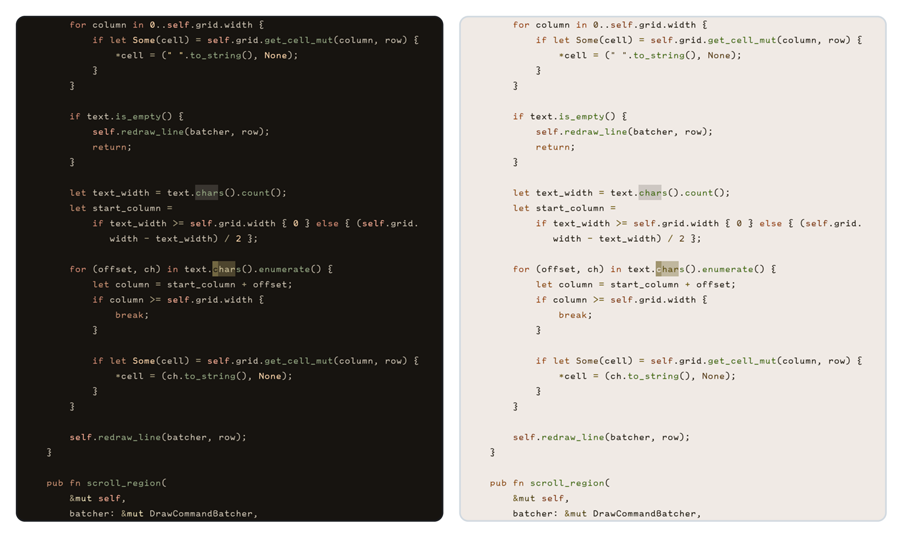

```lua
xeno.color('moss', '#7c9463')
xeno.color('fern', '#8fae6e')
xeno.color('olive', '#9c9257')
xeno.color('mustard', '#c9a227')
xeno.color('amber', '#d69a3d')
xeno.color('rust', '#b06a35')
xeno.color('terracotta', '#c1663b')
xeno.color('sepia', '#a1815a')
xeno.color('khaki', '#b6a679')

xeno.theme('vintage', {
  background = '#2c2620',
  accent = '#8a7a3f',
  foreground = '#d9cbb3',
  properties = {
    contrast = -0.20,
    variation = 0.10,
    chroma = -0.30,
    lightness = 0.20,
  },

  highlights = {
    editor = {
      CursorLineNr = { fg = '@amber.100', bold = true },
      MatchParen = { fg = '@amber.100', bold = true },
    },
    syntax = {
      Comment = { fg = '@sepia.400', italic = true },
      Keyword = { fg = '@rust.300' },
      Conditional = { fg = '@terracotta.300' },
      Function = { fg = '@moss.300' },
      Type = { fg = '@fern.200' },
      String = { fg = '@mustard.100' },
      Number = { fg = '@amber.100' },
      Boolean = { fg = '@amber.100' },
      Variable = { fg = '@foreground.300' },
      Property = { fg = '@olive.300' },
      Operator = { fg = '@khaki.300' },
      Punctuation = { fg = '@foreground.400' },

      ['@keyword'] = { link = 'Keyword' },
      ['@keyword.return'] = { link = 'Keyword' },
      ['@keyword.function'] = { link = 'Conditional' },
      ['@keyword.conditional'] = { link = 'Conditional' },
      ['@keyword.repeat'] = { link = 'Conditional' },
      ['@keyword.operator'] = { fg = '@khaki.300' },
      ['@keyword.import'] = { fg = '@sepia.400' },

      ['@function'] = { link = 'Function' },
      ['@function.builtin'] = { fg = '@fern.100' },
      ['@type'] = { link = 'Type' },
      ['@string'] = { link = 'String' },
      ['@string.escape'] = { fg = '@rust.100' },
      ['@number'] = { link = 'Number' },
      ['@boolean'] = { link = 'Boolean' },
      ['@constant'] = { fg = '@amber.100' },
      ['@constant.builtin'] = { fg = '@amber.100', bold = true },

      ['@variable'] = { link = 'Variable' },
      ['@variable.builtin'] = { fg = '@terracotta.200' },
      ['@property'] = { link = 'Property' },
      ['@constructor'] = { fg = '@foreground.400' },

      ['@lsp.type.variable'] = { link = '@variable' },
      ['@lsp.type.property'] = { link = '@property' },
      ['@lsp.mod.declaration'] = { clear = true },
      ['@lsp.typemod.property.declaration'] = { link = '@property' },

      ['@operator'] = { link = 'Operator' },
      ['@punctuation'] = { link = 'Punctuation' },
      ['@punctuation.bracket'] = { link = 'Punctuation' },
      ['@punctuation.delimiter'] = { link = 'Punctuation' },
    },
  },
})
```

## Winter Sky

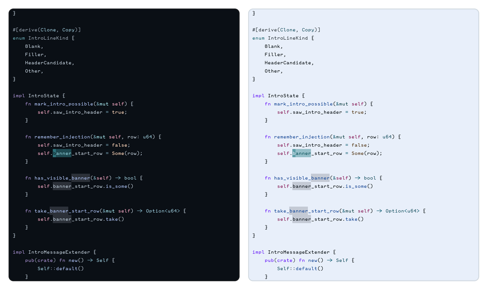

```lua
xeno.color('cyan', '#7ec8d4')
xeno.color('ice', '#9fd3e8')
xeno.color('periwinkle', '#8ba3d9')
xeno.color('lavender', '#a08bd0')
xeno.color('mauve', '#b593c9')
xeno.color('rose', '#d98fae')
xeno.color('amber', '#e0a878')
xeno.color('coral', '#d98f78')

xeno.theme('winter-sky', {
  background = '#161c24',
  accent = '#7ec8d4',
  foreground = '#c8d8e8',
  properties = { contrast = -0.10, chroma = -0.05, lightness = 0.10 },

  highlights = {
    editor = {
      CursorLineNr = { fg = '@amber.100', bold = true },
      MatchParen = { fg = '@amber.100', bold = true },
      Visual = { bg = xeno.opaque('@accent.400', 0.15) },
      CursorLine = { bg = xeno.opaque('@background.600', 0.05) },
    },
    syntax = {
      Comment = { fg = '@foreground.400', italic = true },
      Keyword = { fg = '@lavender.300' },
      Conditional = { fg = '@mauve.300' },
      Function = { fg = '@periwinkle.200' },
      Type = { fg = '@ice.200' },
      String = { fg = '@rose.100' },
      Number = { fg = '@amber.100' },
      Boolean = { fg = '@amber.100' },
      Variable = { fg = '@foreground.300' },
      Property = { fg = '@cyan.300' },
      Operator = { fg = '@ice.300' },
      Punctuation = { fg = '@foreground.400' },

      ['@keyword'] = { link = 'Keyword' },
      ['@keyword.return'] = { link = 'Keyword' },
      ['@keyword.function'] = { link = 'Conditional' },
      ['@keyword.conditional'] = { link = 'Conditional' },
      ['@keyword.repeat'] = { link = 'Conditional' },
      ['@keyword.operator'] = { fg = '@ice.300' },
      ['@keyword.import'] = { fg = '@cyan.400' },

      ['@function'] = { link = 'Function' },
      ['@function.builtin'] = { fg = '@periwinkle.100' },
      ['@type'] = { link = 'Type' },
      ['@string'] = { link = 'String' },
      ['@string.escape'] = { fg = '@coral.100' },
      ['@number'] = { link = 'Number' },
      ['@boolean'] = { link = 'Boolean' },
      ['@constant'] = { fg = '@amber.100' },
      ['@constant.builtin'] = { fg = '@amber.100', bold = true },

      ['@variable'] = { link = 'Variable' },
      ['@variable.builtin'] = { fg = '@rose.200' },
      ['@property'] = { link = 'Property' },
      ['@constructor'] = { fg = '@foreground.400' },

      ['@operator'] = { link = 'Operator' },
      ['@punctuation'] = { link = 'Punctuation' },
      ['@punctuation.bracket'] = { link = 'Punctuation' },
      ['@punctuation.delimiter'] = { link = 'Punctuation' },

      ['@lsp.type.variable'] = { link = '@variable' },
      ['@lsp.type.property'] = { link = '@property' },
      ['@lsp.type.function'] = { link = '@function' },
      ['@lsp.type.type'] = { link = '@type' },
      ['@lsp.type.keyword'] = { link = '@keyword' },
      ['@lsp.mod.declaration'] = { clear = true },
      ['@lsp.typemod.property.declaration'] = { link = '@property' },
    },
  },
})
```
