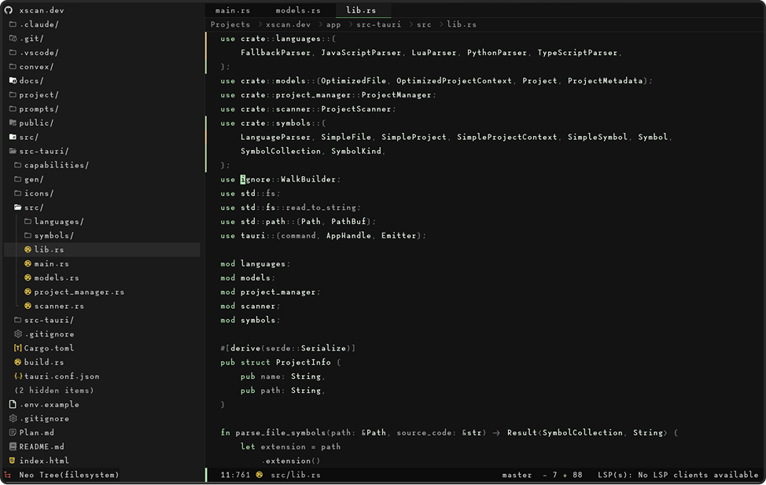
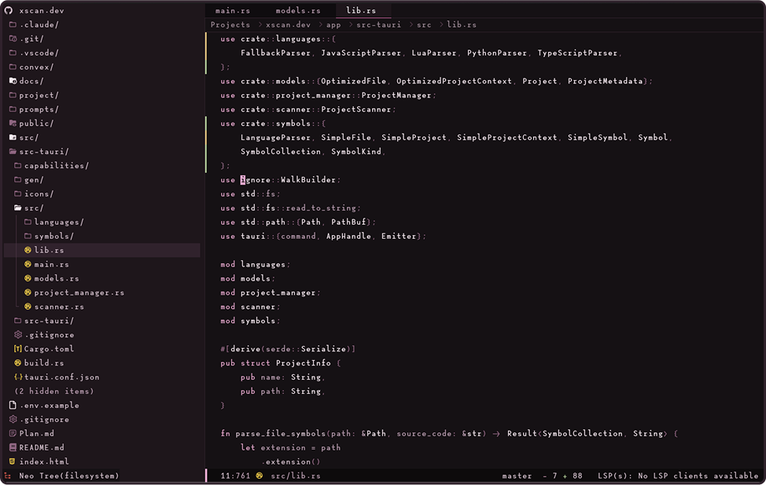
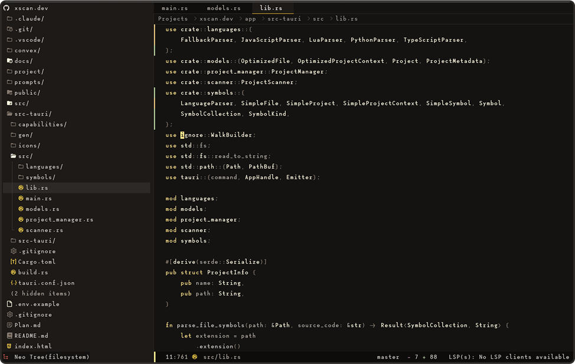

# Theme Examples

## Preview Gallery

Go over basic syntax for developing a theme, we'll leverage a
new method for creating colors, something like

```lua
local red = xeno.color('red', '#ff0000')
```

This will generate the highlights and color scales for any given color which you can then use in your highlights table

Show case the over all capabilities of 

We'll showcase various levels of complexity, minimal two colors,
additional third color. and some more advanced configurations
which use two custom colors. 

We'll include some blogs for creating a good color scheme,
along with some additional resources for working with colors, and
creating a nice looking colorscheme








